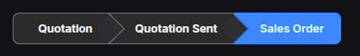

# **Overview**

The **Progress Stepper** component extends FilamentPHP’s `ToggleButtons` to visually represent order states. It is particularly useful for displaying the current progress of an entity, such as an order, with predefined states in **Aureus ERP**.

## **Definition**

To use the `ProgressStepper` component, ensure that the following class is present in your project:

```php
<?php

namespace Webkul\Field\Filament\Forms\Components;

use Filament\Forms\Components\ToggleButtons;

class ProgressStepper extends ToggleButtons
{
    protected string $view = 'fields::filament.forms.components.progress-stepper.index';
}
```

## **Usage in Forms**

To integrate the `ProgressStepper` component into a Filament form, use the following configuration:

```php
use Webkul\Field\Filament\Forms\Components\ProgressStepper;
use Filament\Forms\Form;

public static function form(Form $form): Form
{
    return $form
        ->schema([
            ProgressStepper::make('state')
                ->hiddenLabel()
                ->inline()
                ->options(fn ($record) => self::getStateOptions($record))
                ->default(OrderState::DRAFT->value)
                ->disabled()
                ->live()
                ->reactive(),
        ]);
}

protected static function getStateOptions($record): array
{
    $options = OrderState::options();

    if ($record && $record->state !== OrderState::CANCEL->value) {
        unset($options[OrderState::CANCEL->value]);
    }

    if (!$record) {
        unset($options[OrderState::CANCEL->value]);
    }

    return $options;
}
```

## **Example Output**



## **Key Features**

- **Extends Filament’s `ToggleButtons`**: Ensures seamless integration with Filament forms.
- **Dynamic Order State Management**: Automatically adjusts available states based on the current order state.
- **Live & Reactive**: Updates dynamically as data changes.
- **Customizable View**: Uses a dedicated Blade template for further customization.

## More Information

For more details, refer to the [FilamentPHP Toggle Buttons](https://filamentphp.com/docs/3.x/forms/fields/toggle-buttons).
