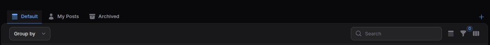
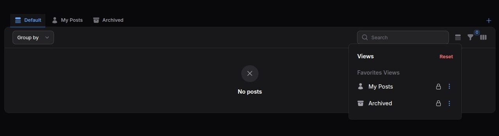

# Overview

The **Table Views** is a powerful feature in Aureus ERP that enhances data filtering and organization capabilities. It provides advanced customization options for table filters throughout the application, allowing users to create, save, and manage personalized views of tabular data.

## Core Components

### PresetView Class

The `PresetView` class extends Filament's `Tab` component and serves as the foundation for creating predefined table views. It provides functionality for creating customizable, savable views with various properties.

```php
namespace Webkul\TableViews\Filament\Components;
```

#### Key Properties

- **ID**: Unique identifier for the preset view
- **Color**: Visual indicator for the view tab
- **Default Status**: Whether the view is set as default
- **Favorite Status**: Whether the view is marked as a favorite
- **Editability**: Whether the view can be edited
- **Replaceability**: Whether the view can be replaced
- **Deletability**: Whether the view can be deleted

#### Main Methods

```php
// Set the color of the view
public function color(string|Closure|null $color): static

// Set as a favorite view
public function favorite(bool|Closure $condition = true): static

// Set as the default view
public function default(bool|Closure $condition = true): static

// Check if view is set as default
public function isDefault(): bool

// Check if view is a favorite
public function isFavorite(string|int|null $id = null): bool

// Additional helper methods for status checks
public function isEditable(): bool
public function isReplaceable(): bool
public function isDeletable(): bool
```

## Saved View System

### SavedView Class

The `SavedView` class extends `PresetView` to handle user-created custom views:

```php
namespace Webkul\TableViews\Filament\Components;
```

#### Key Features

```php
// Associate with a TableView model
public function model(TableView $model): static

// Get the associated model
public function getModel(): TableView

// Check favorite status
public function isFavorite(string|int|null $id = null): bool

// Check public visibility
public function isPublic(): bool

// Permission checks
public function isEditable(): bool
public function isReplaceable(): bool
public function isDeletable(): bool
```

### HasTableViews Trait

The `HasTableViews` trait is used in Filament resource pages to implement table view functionality. It provides the infrastructure to define and manage preset views for tables.

```php
namespace Webkul\TableViews\Filament\Concerns;
```

When applied to a resource page, this trait:

- Enables the definition of preset views through the `getPresetTableViews()` method
- Handles saving, loading, and managing user-specific views
- Integrates with Filament's table component to apply filters and sorting

## Implementation Example

The `ListBlogs` class demonstrates how to implement table views in a resource page:

```php
namespace Webkul\Blog\Filament\Admin\Clusters\Blog\Resources\BlogResource\Pages;
```

This class uses the `HasTableViews` trait and defines multiple preset views for the Blogs table:

```php
public function getPresetTableViews(): array
{
    return [
        'my_posts' => PresetView::make(__('My Posts'))
            ->icon('heroicon-o-user')
            ->favorite()
            ->modifyQueryUsing(fn (Builder $query) => $query->where('user_id', Auth::id())),

        // Additional views defined...
    ];
}
```

## Customizing Queries

Each preset view can modify the underlying query using the `modifyQueryUsing` method. This allows for powerful filtering capabilities:

```php
->modifyQueryUsing(fn (Builder $query) => $query->where('author_id', Auth::id()))
```

## User Favorites System

The system includes a favorites mechanism through the `TableViewFavorite` model, which stores user preferences for views:

```php
public function isFavorite(string|int|null $id = null): bool
{
    $tableViewFavorite = TableViewFavorite::query()
        ->where('user_id', auth()->id())
        ->where('view_type', 'preset')
        ->where('view_key', $id)
        ->first();

    return (bool) ($tableViewFavorite?->is_favorite ?? $this->evaluate($this->isFavorite));
}
```

## Icons and Visual Indicators

Preset views can include icons for better visual recognition:

```php
->icon('heroicon-o-clock')
```

## Localization Support

The example shows proper use of translation strings for view labels:

```php
PresetView::make(__('blogs::filament/admin/clusters/blogs/resources/posts/pages/list-posts.tabs.my-posts'))
```

## **Example Output of Table View Filters**



## **Example Output of Filters View**



## Database Structure

The table views system relies on database tables to store:

- User-defined views
- Favorite status for views
- Default view preferences

## Integration with Filament

Table Views integrates with Filament's resources and table components, extending their capabilities while maintaining compatibility with the Filament ecosystem.

## Best Practices

1. **Naming Convention**: Use clear, descriptive keys for your preset views
2. **Query Optimization**: Be mindful of query performance when using `modifyQueryUsing`
3. **User Experience**: Set sensible default views for different user roles
4. **Translations**: Use localization keys for all user-facing text
5. **Icons**: Choose meaningful icons that help users identify view purposes

## Extending Table Views

The Table Views system can be extended with:

- Custom view types beyond presets
- Additional filtering mechanisms
- User permission controls for view management
- Export functionality for specific views
- Scheduled or automated view generation

By leveraging Table Views in Aureus ERP, you can create a more personalized and efficient data browsing experience for your users, allowing them to quickly access the specific data subsets they need.
